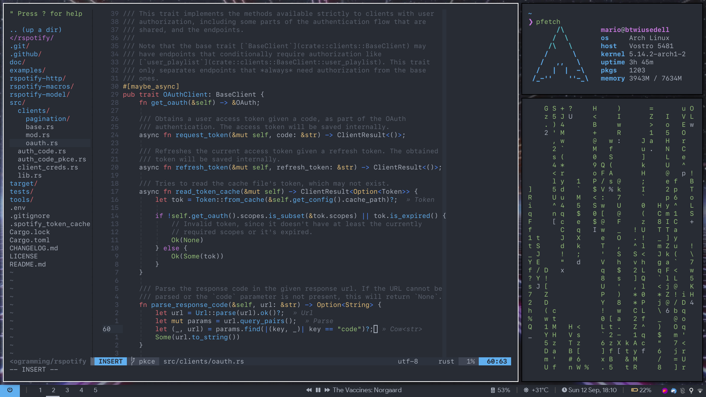

# My dotfiles

My dotfiles for Arch Linux.



[← 2020 dotfiles](https://github.com/marioortizmanero/dotfiles-2020)

## Setup Information

* Terminal: [alacritty](https://github.com/alacritty/alacritty)
* Shell: [zsh](https://wiki.archlinux.org/index.php/zsh)
* Editor: [neovim](https://neovim.io/)
* File manager: [nnn](https://github.com/jarun/nnn),
  [thunar](https://wiki.archlinux.org/index.php/Thunar)
* Fonts: [SF Mono](https://github.com/supercomputra/SF-Mono-Font), [Product
  Sans](https://befonts.com/product-sans-font.html)
* Status bar: [polybar](https://github.com/polybar/polybar)
* Window manager: [bspwm](https://github.com/baskerville/bspwm)
* Display manager: [lightdm](https://wiki.archlinux.org/index.php/LightDM)
* Notification daemon: [dunst](https://github.com/dunst-project/dunst)
* Wallpaper:


[Pywal](https://github.com/dylanaraps/pywal) is configured for most of these to
switch between the light ([solarized](https://ethanschoonover.com/solarized/))
and dark ([onedark](https://github.com/joshdick/onedark.vim)) mode
automatically: Bspwm, Neovim, Alacritty (zsh), Rofi, Polybar, Dunst, GTK.

## Usage

This repository contains the following directories of interest:

* `~/.local/bin`: my custom scripts. This includes `setup-freeze`, which makes a
  snapshot of the system's currently installed programs, files and specs and
  saves it into `~/.local/share/setup-freeze`. It also supports custom scripts
  to e.g. make a quick backup of Spotify.
* `Documents/Cheatsheets`: some useful guides/cheatsheets I use.

## Installation

The dotfiles are managed with [git, as described in this
article](https://antelo.medium.com/how-to-manage-your-dotfiles-with-git-f7aeed8adf8b).

Do note that this repository may contain censored parts after being published
online. If you are importing my dotfiles, do a `grep -r '\[REMOVED\]'`, which are
parts that have been manually removed for privacy reasons. Just replace these
with whatever you consider fits right.

Here's the list of things I usually do after installing the Operating System:

* `pacman -S base base-devel git`

* Install [yay](https://github.com/Jguer/yay)

* A run with `reflector` for an optimal mirrorlist

* Import the dotfiles into the system:

  ```sh
  git clone --bare git@github.com:marioortizmanero/dotfiles.git ~/.dotfiles
  cp ~/.dotfiles/.zshrc ~ && source ~/.zshrc
  dots submodule init && dots submodule update
  dots checkout
  ```

* Install all the listed programs in
  `~/.local/share/setup-freeze/out/installed.txt`

* Configure ZSH: `chsh -s "$(which zsh)"`

* Configure makepkg in `/etc/makepkg.conf`:

  ```ini
  MAKEFLAGS="-j$(($(nproc) + 1))"
  ```

* Uncomment some lines in `/etc/pacman.conf`:

  ```ini
  Color
  IgnorePkg         = jdk8
  ParallelDownloads = 5
  ```
  
  ```ini
  [multilib]
  Include = /etc/pacman.d/mirrorlist
  ```

* Configure lightdm:

  ```sh
  sudo ln --force ~/.config/background.png /usr/share/backgrounds/main.png
  sudo ln --force ~/.config/avatar.png /usr/share/pixmaps/tux.png
  sudo ln --force ~/.config/lightdm/{lightdm.conf,lightdm-webkit2-greeter.conf,initscript.sh} /etc/lightdm/
  ```

  [Patch the
  theme](https://github.com/manilarome/lightdm-webkit2-theme-glorious/issues/49#issuecomment-864584154)

  And set the `Icon` option in `/var/lib/AccountsService/users/<USER>` to
  `/usr/share/pixmaps/tux.png`.

* Defaults handlers:

  ```sh
  xdg-mime default firefox.desktop x-scheme-handler/http
  xdg-mime default firefox.desktop x-scheme-handler/https
  ```

* Activate some services:
  * `ntpd` to synchronize the time automatically.
  * Dark and light mode setters:

    ```sh
    systemctl --user enable {light,dark}-theme.{service,timer}
    ```

* Configure Firefox:
  * General settings:
    * Enable `Use autoscrolling`
  * `about:config`:
    * Disable `middlemouse.click`
    * Set `security.dialog_enable_delay` to 0

* Symlinks:
  * `ln -s ~/Downloads ~/Desktop`

* Configure MegaSync excluded patterns (until
  https://github.com/meganz/MEGAsync/issues/412 is implemented):

  ```
  .git
  .vim
  desktop.ini
  __pycache__
  *.o
  *.so
  .venv
  *.a
  a.out
  ```

* Configure GRUB in case suspend doesn't work properly
  (https://forums.linuxmint.com/viewtopic.php?t=220927):

  ```
  $ sudo nvim /etc/default/grub
  # Update this line:
  GRUB_CMDLINE_LINUX="i8042.nomux=1"
  $ sudo grub-mkconfig -o /boot/grub/grub.cfg
  ```

* Configure Thunar "Open Terminal Here":
  * Edit > Configure Custom Actions
  * Config button for "Open Terminal Here"
  * Change command to `alacritty --working-directory %f`

* Configure Font Manager:
  * Settings > Sources
  * Add source with fonts directory
  * Activate the toggle for the new source
